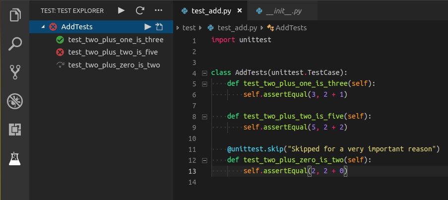

# Python Test Explorer for Visual Studio Code

This extension allows you to run your Python [Unittest](https://docs.python.org/3/library/unittest.html#module-unittest) 
tests with the [Test Explorer UI](https://marketplace.visualstudio.com/items?itemName=hbenl.vscode-test-explorer).

## Features
* Shows a Test Explorer in the Test view in VS Code's sidebar with all detected tests and suites and their state
* Shows a failed test's log when the test is selected in the explorer

## Getting started
* Install the extension
* Reload VS Code and open the Test view
* Configure Python extension for Visual Studio Code to discover your tests 
  (see [Configuration section](#configuration) and 
       [Unittest documentation](https://docs.python.org/3/library/unittest.html#module-unittest))
* Run your tests using the  icon in the Test Explorer

## Configuration

The extension uses the configuration from [Python extension for Visual Studio Code](https://marketplace.visualstudio.com/items?itemName=ms-python.python).
To configure Python for your project see [Getting Started with Python in VS Code](https://code.visualstudio.com/docs/python/python-tutorial).
List of currently used properties:

Property                          | Description
----------------------------------|---------------------------------------------------------------
`python.pythonPath`               | Path to Python
`python.unitTest.cwd`             | Optional working directory for unit tests
`python.unitTest.unittestEnabled` | Whether to enable or disable unit testing using unittest (enables or disables test discovery for Test Explorer)
`python.unitTest.unittestArgs`    | Arguments used for test discovery (currently only `-s` and `-p` arguments are considered)
